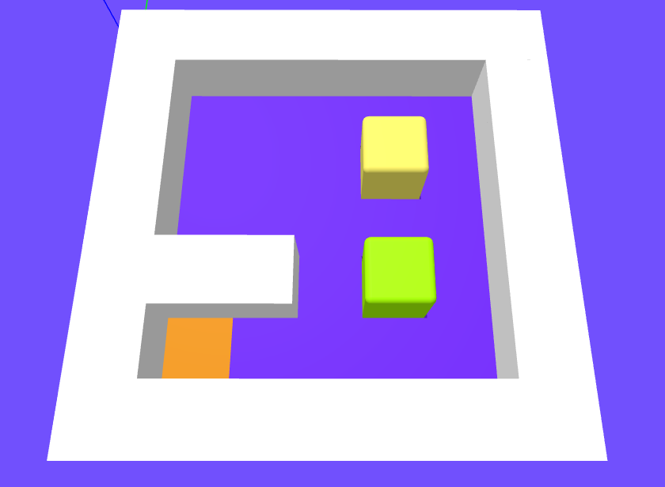

# BOX IT!



This a mace box game where you have to move the box to the target location. The game is written using the following technologies:

- Typescript
- Three.js


## Contributing

We welcome contributions to this game. Here are some guidelines to help you get started:

### Contributing Code

1. Fork the repository on GitHub.
2. Create a new branch from `main` (e.g., `feature/my-new-feature`).
3. Make your changes and commit them with clear and descriptive messages.
4. Push your changes to your forked repository.
5. Create a pull request to the `main` branch of the original repository.

### Running the Project and Testing
To run the project and test the extension, follow these steps:

Prerequisites
- Node.js

Installation
Clone the repository:

```bash
git clone https://github.com/your-username/your-repo-name.git
```

Navigate to the project folder:

```bash
cd your-repo-name
```

Install the dependencies:

```bash
npm install
```

Run the project

```bash
npx vite
```
